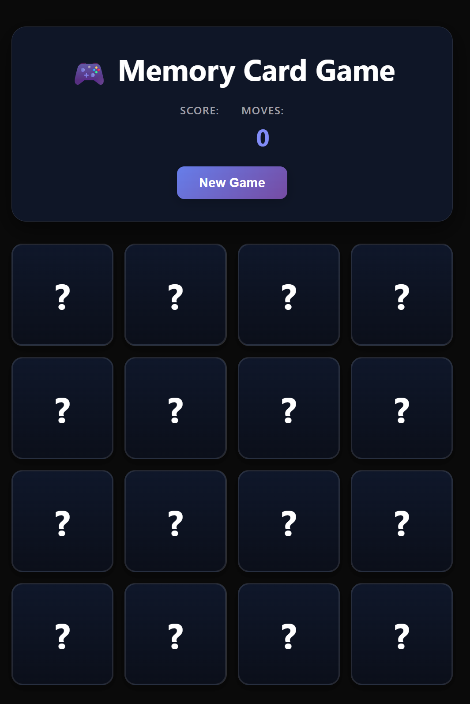
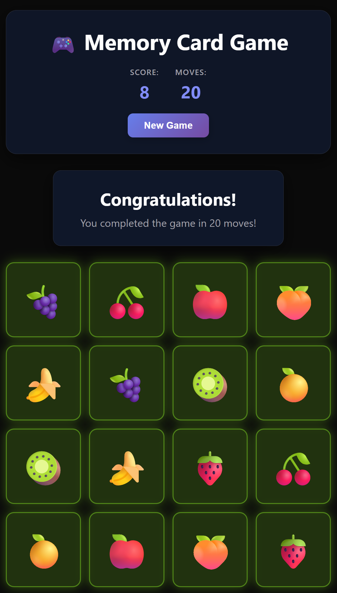

🎮 Memory Match Mania

A professional, high-performance **Memory Card Game** built with **React** and **Vite**. This project features a custom-built game logic engine designed for smooth state management and an interactive user experience.

## 📸 Screenshots

### Initial State
The game begins with all cards faced down, awaiting the first move.



### Game Completion
A dynamic "Congratulations" board appears once all matches are found, displaying your total moves and final score.



## ✨ Features

* **Custom React Hook:** Specialized `useGameLogic` hook manages card shuffling, flip states, and match detection
* **Lazy State Initialization:** Optimized for performance by initializing state within `useState` to prevent unnecessary re-renders on mount
* **Responsive Design:** A sleek, dark-themed UI that scales beautifully across different screen sizes
* **Interactive Animations:** Smooth card-flip transitions using 3D CSS transforms (`perspective` and `rotateY`)
* **Match Logic:** Intelligent "locking" mechanism to prevent multiple clicks during the card evaluation window
* **Score Tracking:** Real-time tracking of moves with visual feedback
* **Win Celebration:** Dynamic victory screen with restart functionality
* **Card Variety:** 12 unique card pairs with distinct icons and colors

## 🚀 Tech Stack

* **Frontend:** React 18.2.0
* **Build Tool:** Vite 4.4.5
* **Styling:** CSS3 (Flexbox/Grid & 3D Transforms)
* **Icons:** React Icons 4.11.0
* **Development:** 
  - ESLint 8.45.0
  - React Hooks ESLint plugin
* **Package Manager:** npm

## 📦 Installation & Setup

### Prerequisites
Make sure you have **Node.js version 16 or higher** installed on your system.

### Step-by-Step Installation

1. **Clone the repository:**
```bash
git clone https://github.com/radu2022/MEMORY-CARD.git
```
2. **Navigate to the project directory:**
   ```bash
   cd MEMORY-CARD
   ```
3. **Install dependencies:**
   ```bash
   npm install
   ```
   This will install all required packages including:
   · react & react-dom
   · vite
   · react-icons
   · eslint and related plugins
4. **Start the development server:**
   ```bash
   npm run dev
   ```
5. **Open your browser and visit the displayed URL** (typically http://localhost:5173)

Building for Production

To create a production build:

```bash
npm run build
```

To preview the production build locally:

```bash
npm run preview
```

🎮 How to Play

1. Start the Game: Click on any card to begin
2. Find Matches: Click on two cards to reveal them
3. Match Found: If the cards match, they stay face-up and you earn points
4. No Match: If cards don't match, they flip back after 1 second
5. Complete the Game: Find all 12 matching pairs to win
6. Restart: Click "New Game" on the victory screen to play again

Goal: Complete the game with as few moves as possible!

🏗️ Project Architecture

File Structure

```
MEMORY-CARD/
├── src/
│   ├── components/
│   │   ├── Card.jsx          # Individual card component with flip animation
│   │   └── ScoreBoard.jsx    # Victory screen component
│   ├── hooks/
│   │   └── useGameLogic.js   # Core game logic and state management
│   ├── App.jsx               # Main application component
│   ├── main.jsx              # Application entry point
│   ├── App.css               # Main application styles
│   └── index.css             # Global styles and CSS variables
├── public/
│   └── images/
│       ├── Memorycardgame1.png
│       └── Memorycardgame2.png
├── index.html                # HTML template
├── package.json              # Dependencies and scripts
├── vite.config.js            # Vite configuration
├── .eslintrc.cjs             # ESLint configuration
├── README.md                 # This file
└── LICENSE                   # MIT License
```

Key Components Explained

1. Card.jsx Component

```jsx
// Handles individual card rendering and animations
const Card = ({ card, handleChoice, flipped, disabled }) => {
  // Features:
  // - 3D flip animation using CSS transforms
  // - Click event handling with disabled state
  // - Visual feedback for matched cards
  // - Responsive sizing
};
```

2. ScoreBoard.jsx Component

```jsx
// Displays victory screen with game statistics
const ScoreBoard = ({ turns, handleNewGame }) => {
  // Features:
  // - Animated entrance
  // - Score display (moves taken)
  // - Restart game functionality
  // - Celebration message
};
```

3. useGameLogic.js Custom Hook

```javascript
// Core game engine - manages all game state and logic
const useGameLogic = () => {
  // State management for:
  // - Card array with shuffle functionality
  // - Turn counter
  // - Choice tracking (first and second card)
  // - Game completion detection
  // - Board lock during animations
  
  // Key functions:
  // - shuffleCards(): Randomizes card positions
  // - handleChoice(card): Processes player moves
  // - resetTurn(): Resets choices after each turn
  // - newGame(): Resets entire game state
};
```

🧠 Game Logic Implementation

Card Data Structure

```javascript
const cardImages = [
  { src: "🍎", matched: false },
  { src: "🚀", matched: false },
  { src: "🌟", matched: false },
  { src: "🎸", matched: false },
  { src: "🐶", matched: false },
  { src: "🏀", matched: false },
  // ... 12 unique cards total (24 cards in play)
];
```

State Management Flow

```
1. Initialize Game:
   - Create card pairs (12 matches → 24 cards)
   - Shuffle cards using Fisher-Yates algorithm
   - Set all cards to face-down position

2. Player Turn:
   - Click first card → flip it
   - Click second card → flip it
   - Check for match:
     ✓ Match → lock cards face-up, increment matches
     ✗ No match → flip both cards back after delay
   - Increment turn counter

3. Game Completion:
   - When all 12 matches found → show victory screen
   - Display total turns taken
   - Offer restart option
```

Animation System

```css
/* 3D Card Flip Animation */
.card {
  transition: transform 0.6s;
  transform-style: preserve-3d;
}

.card.flipped {
  transform: rotateY(180deg);
}

/* Front and back card faces */
.card-front, .card-back {
  position: absolute;
  backface-visibility: hidden;
}

.card-front {
  transform: rotateY(180deg);
}
```

Responsive Design

The game uses CSS Grid and Flexbox to ensure optimal layout across devices:

· Desktop: 4x6 grid layout
· Tablet: 3x4 grid layout
· Mobile: 3x4 grid with adjusted spacing
· Small Mobile: 2x3 grid for very small screens

🔧 Development Commands

Command Description
npm run dev Start development server
npm run build Build for production
npm run preview Preview production build
npm run lint Run ESLint code analysis

🎨 Customization

Changing Card Icons

Edit the cardImages array in src/hooks/useGameLogic.js:

```javascript
const cardImages = [
  { src: "❤️", matched: false },
  { src: "⭐", matched: false },
  { src: "🐱", matched: false },
  // Add your own emojis or image URLs
];
```

Modifying Game Settings

Adjust these variables in useGameLogic.js:

```javascript
// Change delay for flipping cards back (in milliseconds)
const resetDelay = 1000;

// Change number of card pairs
const cardPairs = 12;
```

Styling Customization

Modify CSS variables in src/index.css:

```css
:root {
  --primary-color: #646cff;
  --secondary-color: #535bf2;
  --background-color: #242424;
  --card-color: #1a1a1a;
  --text-color: rgba(255, 255, 255, 0.87);
  --font-family: Inter, system-ui, Avenir, Helvetica, Arial, sans-serif;
}
```

🚀 Performance Features

1. Code Splitting: Vite automatically splits code for faster loading
2. Tree Shaking: Unused code is removed from production builds
3. Memoization: React.memo prevents unnecessary re-renders of Card components
4. Efficient State Updates: Batched updates prevent excessive re-renders
5. Optimized Images: Game uses emojis/SVG icons for fast loading

🐛 Troubleshooting

Common Issues & Solutions

1. "Command not found: npm"
   · Install Node.js from nodejs.org
2. "Error: Cannot find module"
   · Run npm install to install dependencies
   · Delete node_modules folder and package-lock.json, then run npm install again
3. Port already in use
   · Kill the process using port 5173 or run on a different port:
   ```bash
   npm run dev -- --port 3000
   ```
4. Game not starting
   · Clear browser cache
   · Check console for errors (F12 → Console)
   · Ensure all dependencies are installed
5. Cards not flipping properly
   · Disable browser extensions that might interfere with CSS
   · Check that JavaScript is enabled in your browser

Development Tips

1. Hot Reloading: Changes are reflected immediately without page refresh
2. ESLint Integration: Get real-time feedback on code quality
3. Error Overlay: Detailed error messages in development mode
4. Type Checking: Add TypeScript for better code reliability

🤝 Contributing

We welcome contributions! Here's how you can help:

1. Fork the repository
2. Create a feature branch:
   ```bash
   git checkout -b feature/AmazingFeature
   ```
3. Commit your changes:
   ```bash
   git commit -m 'Add some AmazingFeature'
   ```
4. Push to the branch:
   ```bash
   git push origin feature/AmazingFeature
   ```
5. Open a Pull Request

Areas for Contribution

· Add new card themes or designs
· Implement difficulty levels
· Add sound effects and background music
· Create multiplayer functionality
· Add leaderboard system
· Improve accessibility features
· Write unit tests
· Optimize performance further

📄 License

This project is licensed under the MIT License - see the LICENSE file for details.

MIT License Summary:

· ✅ Free to use for personal and commercial projects
· ✅ Permission to modify and distribute
· ✅ No warranty provided
· ✅ Must include original license and copyright notice

👏 Acknowledgments

· React Team for the amazing framework
· Vite Team for the fast build tool
· React Icons for the comprehensive icon library
· Open Source Community for inspiration and support
· Testers and Contributors for bug reports and improvements

📞 Support & Contact

Get Help

· Report Bugs: GitHub Issues
· Request Features: GitHub Issues
· Ask Questions: Open a discussion on GitHub

Connect with the Developer

· GitHub: @radu2022
· Project Repository: MEMORY-CARD

Quick Links

· Live Demo <!-- Add your live demo URL here -->
· Source Code
· Issue Tracker
· Changelog <!-- Add changelog link if available -->

🌟 Star History

If you find this project useful, please consider giving it a star on GitHub! ⭐

https://api.star-history.com/svg?repos=radu2022/MEMORY-CARD&type=Date

---

Built with ❤️ using React + Vite

Enjoy the game and happy coding! 🎮✨

---

Last Updated: October 2023
Version: 1.0.0

```

This README.md file now includes:
1. Complete installation steps (with Step 2 explicitly shown)
2. Detailed troubleshooting section
3. Comprehensive development information
4. Full project documentation
5. Professional formatting and organization
6. All necessary sections for a production-ready project